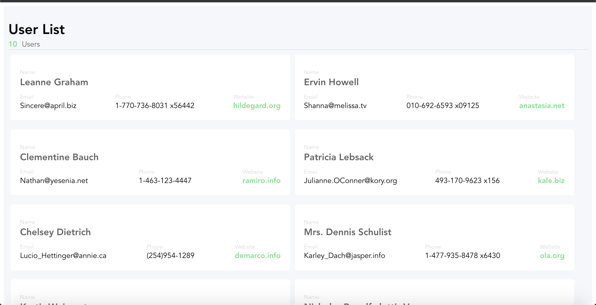

# vue-test-code

## Project setup
```
yarn install
```

### Compiles and hot-reloads for development
```
yarn serve
```

### Compiles and minifies for production
```
yarn build
```

### Lints and fixes files
```
yarn lint
```

### Customize configuration
See [Configuration Reference](https://cli.vuejs.org/config/).

Expected Output :


# RESOLVE THE WEBSITE 

1. Add mapState to computed vuex binding.
2. Handling error ajax.
3. Remove { INCREMENT } import from mutations type because { INCREMENT } undefined on mutations types. 
4. Change Actions setDatas method to SET_DATA, because set data mutation not defined.
5. Change variable state from list to lists. 
6. Change variable type from null to array this is use to counter length methods.
7. Change function getCountData to counter the length state of lists.
8. Add css style and html tag.